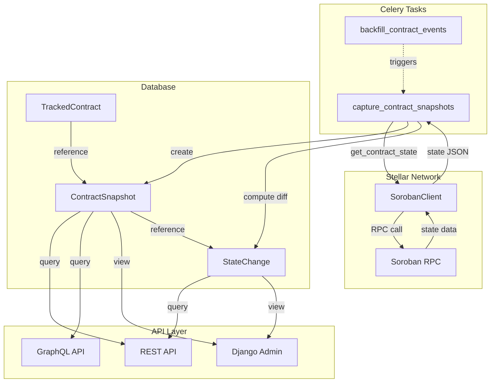

# Design Document: Contract State Snapshots

## Overview

The Contract State Snapshots feature extends SoroScan's monitoring capabilities by capturing and tracking contract state over time. This system periodically retrieves the complete state of tracked Soroban smart contracts from the Stellar network, stores snapshots at configurable ledger intervals, computes state differences between consecutive snapshots, and exposes this historical data through REST and GraphQL APIs.

### Key Capabilities

- Periodic state capture at configurable ledger intervals (default: every 1000 ledgers)
- Complete state storage as JSON with size constraints (1 MB limit)
- Automatic state difference calculation between consecutive snapshots
- Field-level change tracking with old/new value comparison
- REST API endpoints for snapshot and state change retrieval
- GraphQL query interface for point-in-time state queries
- Django admin interface for state timeline visualization
- Integration with existing SoroScan indexing infrastructure

### Design Goals

1. **Minimal Performance Impact**: Leverage existing Celery task infrastructure and batch processing patterns
2. **Storage Efficiency**: Implement size constraints and compression for large state objects
3. **Query Performance**: Use database indexes optimized for time-series queries
4. **Extensibility**: Design models and APIs that can accommodate future enhancements (e.g., state rollback, diff visualization)
5. **Consistency**: Align with existing SoroScan patterns for models, serializers, views, and tasks

## Architecture

### System Components



### Data Flow

1. **Snapshot Capture Flow**:
   - Celery Beat triggers `capture_contract_snapshots` task periodically
   - Task iterates through active TrackedContracts
   - For contracts at snapshot interval ledgers, retrieves state via SorobanClient
   - Creates ContractSnapshot record with state JSON
   - Computes differences from previous snapshot
   - Creates StateChange records for each modified field

2. **Query Flow**:
   - Client requests snapshots via REST or GraphQL
   - API layer queries ContractSnapshot with filters (ledger range, contract)
   - Results serialized and returned with pagination
   - State changes queried separately or joined with snapshots

### Integration Points

- **SorobanClient**: Extended with `get_contract_state()` method for state retrieval
- **Celery Tasks**: New `capture_contract_snapshots` task scheduled via Celery Beat
- **TrackedContract Model**: Uses existing `last_indexed_ledger` field to determine snapshot timing
- **REST Framework**: New viewsets follow existing patterns (TrackedContractViewSet, ContractEventViewSet)
- **GraphQL Schema**: New queries added to existing Strawberry schema
- **Django Admin**: New admin classes registered alongside existing models

## Components and Interfaces

### Database Models

#### ContractSnapshot Model

```python
class ContractSnapshot(models.Model):
    """
    Captures the complete state of a contract at a specific ledger.
    """
    contract = models.ForeignKey(
        TrackedContract,
        on_delete=models.CASCADE,
        related_name="snapshots",
        help_text="Contract this snapshot belongs to"
    )
    ledger_sequence = models.PositiveBigIntegerField(
        db_index=True,
        help_text="Ledger sequence at which this snapshot was captured"
    )
    state_data = models.JSONField(
        help_text="Complete contract state as JSON"
    )
    captured_at = models.DateTimeField(
        auto_now_add=True,
        help_text="Timestamp when snapshot was captured"
    )
    is_truncated = models.BooleanField(
        default=False,
        help_text="True if state_data was truncated due to size constraints"
    )
    is_compressed = models.BooleanField(
        default=False,
        help_text="True if state_data is compressed"
    )
    
    class Meta:
        ordering = ["-ledger_sequence"]
        indexes = [
            models.Index(fields=["contract", "-ledger_sequence"]),
        ]
        constraints = [
            models.UniqueConstraint(
                fields=["contract", "ledger_sequence"],
                name="unique_contract_ledger_snapshot"
            )
        ]
```

#### StateChange Model

```python
class StateChange(models.Model):
    """
    Records a single field change between two consecutive snapshots.
    """
    snapshot = models.ForeignKey(
        ContractSnapshot,
        on_delete=models.CASCADE,
        related_name="changes",
        help_text="Snapshot where this change was detected"
    )
    previous_snapshot = models.ForeignKey(
        ContractSnapshot,
        on_delete=models.SET_NULL,
        null=True,
        blank=True,
        related_name="next_changes",
        help_text="Previous snapshot for comparison"
    )
    field_name = models.CharField(
        max_length=255,
        db_index=True,
        help_text="Dot-notation path to the changed field"
    )
    old_value = models.JSONField(
        null=True,
        blank=True,
        help_text="Previous value (null for additions)"
    )
    new_value = models.JSONField(
        null=True,
        blank=True,
        help_text="New value (null for deletions)"
    )
    created_at = models.DateTimeField(
        auto_now_add=True,
        help_text="Timestamp when change was recorded"
    )
    
    class Meta:
        ordering = ["-created_at"]
        indexes = [
            models.Index(fields=["snapshot", "field_name"]),
        ]
```

### SorobanClient Extension

```python
class SorobanClient:
    def get_contract_state(
        self,
        contract_id: str,
        max_size_bytes: int = 1_048_576  # 1 MB
    ) -> dict[str, Any]:
        """
        Retrieve the complete state of a contract from the Stellar network.
        
        Args:
            contract_id: Contract address (C...)
            max_size_bytes: Maximum allowed state size in bytes
            
        Returns:
            Dictionary containing:
                - success: bool
                - state_data: dict (contract state as JSON)
                - is_truncated: bool
                - is_compressed: bool
                - error: str (if success=False)
                
        Raises:
            ValueError: If contract_id is invalid
            RequestException: If RPC call fails
        """
```

### Celery Tasks

#### capture_contract_snapshots

```python
@shared_task
def capture_contract_snapshots(
    snapshot_interval: int = 1000
) -> dict[str, Any]:
    """
    Capture state snapshots for all active contracts at snapshot intervals.
    
    Iterates through TrackedContracts and captures snapshots when
    last_indexed_ledger is a multiple of snapshot_interval.
    
    Args:
        snapshot_interval: Ledger interval between snapshots
        
    Returns:
        Dictionary with:
            - contracts_processed: int
            - snapshots_created: int
            - changes_detected: int
            - errors: list[dict]
    """
```

#### compute_state_diff

```python
def compute_state_diff(
    current_state: dict,
    previous_state: dict,
    path_prefix: str = ""
) -> list[dict]:
    """
    Recursively compute differences between two state dictionaries.
    
    Args:
        current_state: New state dictionary
        previous_state: Old state dictionary
        path_prefix: Dot-notation prefix for nested fields
        
    Returns:
        List of change dictionaries with:
            - field_name: str (dot-notation path)
            - old_value: Any
            - new_value: Any
    """
```

### REST API

#### Snapshot Endpoints

```python
# GET /api/contracts/{id}/snapshots/
# Query Parameters:
#   - ledger_min: int (optional)
#   - ledger_max: int (optional)
#   - page: int (default: 1)
#   - page_size: int (default: 50, max: 100)

class ContractSnapshotViewSet(viewsets.ReadOnlyModelViewSet):
    """ViewSet for querying contract state snapshots."""
    
    @action(detail=False, methods=["get"])
    def list_for_contract(self, request, contract_id):
        """List all snapshots for a specific contract."""
```

#### State Change Endpoints

```python
# GET /api/contracts/{id}/state-changes/
# Query Parameters:
#   - ledger_min: int (optional)
#   - ledger_max: int (optional)
#   - field_name: str (optional)
#   - page: int (default: 1)
#   - page_size: int (default: 50, max: 100)

class StateChangeViewSet(viewsets.ReadOnlyModelViewSet):
    """ViewSet for querying state changes."""
```

### GraphQL API

```python
@strawberry.type
class ContractStateType:
    contract_id: str
    ledger_sequence: int
    state_data: strawberry.scalars.JSON
    captured_at: datetime
    is_truncated: bool
    is_compressed: bool

@strawberry.type
class Query:
    @strawberry.field
    def contract_state(
        self,
        contract_id: str,
        ledger: int
    ) -> Optional[ContractStateType]:
        """
        Query contract state at or before a specific ledger.
        Returns the most recent snapshot at or before the specified ledger.
        """
    
    @strawberry.field
    def contract_snapshots(
        self,
        contract_id: str,
        ledger_min: Optional[int] = None,
        ledger_max: Optional[int] = None,
        first: int = 20
    ) -> list[ContractStateType]:
        """
        Query multiple snapshots for a contract with optional ledger range.
        """
```

### Django Admin

```python
@admin.register(ContractSnapshot)
class ContractSnapshotAdmin(admin.ModelAdmin):
    list_display = [
        "contract",
        "ledger_sequence",
        "captured_at",
        "is_truncated",
        "is_compressed"
    ]
    list_filter = ["is_truncated", "is_compressed", "captured_at"]
    search_fields = ["contract__contract_id", "contract__name"]
    readonly_fields = ["captured_at"]
    
    def get_queryset(self, request):
        return super().get_queryset(request).select_related("contract")

@admin.register(StateChange)
class StateChangeAdmin(admin.ModelAdmin):
    list_display = [
        "snapshot",
        "field_name",
        "created_at"
    ]
    list_filter = ["field_name", "created_at"]
    search_fields = ["field_name", "snapshot__contract__name"]
    readonly_fields = ["created_at"]
```

## Data Models

### ContractSnapshot Schema

```json
{
  "id": 123,
  "contract": 1,
  "contract_id": "CABC123...",
  "ledger_sequence": 5000,
  "state_data": {
    "balance": "1000000",
    "owner": "GXYZ789...",
    "config": {
      "fee_rate": 0.003,
      "enabled": true
    }
  },
  "captured_at": "2024-01-15T10:30:00Z",
  "is_truncated": false,
  "is_compressed": false
}
```

### StateChange Schema

```json
{
  "id": 456,
  "snapshot": 123,
  "previous_snapshot": 122,
  "field_name": "config.fee_rate",
  "old_value": 0.002,
  "new_value": 0.003,
  "created_at": "2024-01-15T10:30:00Z"
}
```

### State Difference Algorithm

The state difference calculation uses recursive traversal to identify changes at all nesting levels:

1. **Field Addition**: Key exists in current but not in previous → `old_value = null`
2. **Field Deletion**: Key exists in previous but not in current → `new_value = null`
3. **Field Modification**: Key exists in both with different values → both values recorded
4. **Nested Objects**: Recursively traverse with dot-notation path building
5. **Arrays**: Treat as atomic values (entire array compared, not element-wise)

Example:
```python
previous = {"balance": 100, "config": {"fee": 0.01}}
current = {"balance": 200, "config": {"fee": 0.02, "enabled": true}}

# Results in StateChanges:
# - field_name="balance", old_value=100, new_value=200
# - field_name="config.fee", old_value=0.01, new_value=0.02
# - field_name="config.enabled", old_value=null, new_value=true
```


## Correctness Properties

*A property is a characteristic or behavior that should hold true across all valid executions of a system—essentially, a formal statement about what the system should do. Properties serve as the bridge between human-readable specifications and machine-verifiable correctness guarantees.*

### Property 1: Snapshot Uniqueness Constraint

*For any* TrackedContract and ledger_sequence, attempting to create multiple ContractSnapshots with the same contract and ledger_sequence combination should fail after the first, enforcing database uniqueness.

**Validates: Requirements 1.5**

### Property 2: Valid Contract State Retrieval

*For any* valid contract ID, calling `get_contract_state()` should return a success response containing state data in JSON format.

**Validates: Requirements 3.2**

### Property 3: Invalid Contract Error Handling

*For any* invalid contract ID (malformed, non-existent, or wrong network), calling `get_contract_state()` should return an error response without raising an exception.

**Validates: Requirements 3.3**

### Property 4: Active Contract Processing

*For any* set of TrackedContracts with mixed active/inactive status, the snapshot capture task should process only contracts where `is_active=True`, ignoring all inactive contracts.

**Validates: Requirements 4.2**

### Property 5: Snapshot Interval Trigger

*For any* TrackedContract with `last_indexed_ledger` and any positive snapshot interval, a snapshot should be captured if and only if `last_indexed_ledger % snapshot_interval == 0`.

**Validates: Requirements 4.3**

### Property 6: Snapshot Record Completeness

*For any* captured snapshot, the created ContractSnapshot record should contain all required fields: contract reference, ledger_sequence, state_data, and captured_at timestamp.

**Validates: Requirements 4.5**

### Property 7: Configurable Interval Respect

*For any* positive integer snapshot interval value, the capture task should respect that interval when determining which contracts to snapshot, with the default being 1000 ledgers.

**Validates: Requirements 4.6**

### Property 8: Previous Snapshot Identification

*For any* newly created ContractSnapshot, the system should correctly identify the previous snapshot as the most recent snapshot for the same contract with a lower ledger_sequence, or null if no previous snapshot exists.

**Validates: Requirements 5.1**

### Property 9: Comprehensive Change Detection

*For any* two state dictionaries (previous and current), the diff calculation should create StateChange records for all differences, including field additions (old_value=null), deletions (new_value=null), and modifications (both values present).

**Validates: Requirements 5.3, 5.4, 5.5**

### Property 10: Nested Change Detection

*For any* nested state structures (objects within objects, arrays), the diff calculation should detect changes at all nesting levels and represent them with dot-notation field paths (e.g., "config.fee_rate").

**Validates: Requirements 5.6**

### Property 11: Contract Snapshot Query Correctness

*For any* valid contract ID, querying the snapshots endpoint should return exactly the snapshots belonging to that contract and no others.

**Validates: Requirements 6.2**

### Property 12: Ledger Range Filtering

*For any* snapshot query with ledger_min and/or ledger_max parameters, all returned snapshots should have ledger_sequence values within the specified range (inclusive bounds).

**Validates: Requirements 6.3, 6.4, 8.3, 8.4**

### Property 13: Descending Ledger Order

*For any* query returning multiple snapshots or state changes, the results should be ordered by ledger_sequence in descending order (newest first).

**Validates: Requirements 6.5, 8.6**

### Property 14: Invalid Contract 404 Response

*For any* invalid or non-existent contract ID, the REST API snapshot endpoint should return an HTTP 404 status code.

**Validates: Requirements 6.6**

### Property 15: Point-in-Time State Query

*For any* contract and ledger number, the GraphQL `contractState` query should return the snapshot with the highest ledger_sequence that is less than or equal to the requested ledger, or null if no such snapshot exists.

**Validates: Requirements 7.2, 7.3**

### Property 16: GraphQL Invalid Contract Error

*For any* invalid contract ID, the GraphQL `contractState` query should return an error response rather than null or incorrect data.

**Validates: Requirements 7.4**

### Property 17: State Change Query Correctness

*For any* valid contract ID, querying the state-changes endpoint should return exactly the StateChanges associated with snapshots of that contract and no others.

**Validates: Requirements 8.2**

### Property 18: Field Name Filtering

*For any* state change query with a field_name parameter, all returned StateChanges should have a field_name that exactly matches the specified value.

**Validates: Requirements 8.5**

### Property 19: Size Constraint Enforcement

*For any* state data exceeding 1 MB (1,048,576 bytes), the system should truncate the data and set `is_truncated=True` on the ContractSnapshot record.

**Validates: Requirements 11.1**

### Property 20: Truncation Warning Logging

*For any* state data that gets truncated due to size constraints, the system should log a warning message indicating truncation occurred, including the contract ID and ledger sequence.

**Validates: Requirements 11.2**

### Property 21: Compression with Metadata

*For any* state data that is compressed before storage, the system should set `is_compressed=True` on the ContractSnapshot record, and decompression should restore the original data.

**Validates: Requirements 11.3, 11.4**

## Error Handling

### State Retrieval Errors

**Network Failures**:
- Retry with exponential backoff (leveraging Celery's built-in retry mechanism)
- Log error with contract ID and ledger sequence
- Continue processing other contracts (don't fail entire batch)

**Invalid State Data**:
- Log warning with contract ID and raw response
- Skip snapshot creation for that contract
- Record error in task result for monitoring

**Size Constraint Violations**:
- Truncate state data to 1 MB limit
- Set `is_truncated=True` flag
- Log warning with contract ID and original size
- Attempt compression before truncation if available

### Database Errors

**Uniqueness Constraint Violations**:
- Catch `IntegrityError` for duplicate contract/ledger combinations
- Log info message (expected in concurrent scenarios)
- Skip duplicate, continue processing

**Connection Failures**:
- Retry transaction with exponential backoff
- Log error with context
- Fail task to trigger Celery retry

### API Errors

**Invalid Query Parameters**:
- Return HTTP 400 with descriptive error message
- Validate ledger ranges (min <= max)
- Validate pagination parameters (positive integers)

**Missing Resources**:
- Return HTTP 404 for non-existent contracts
- Return empty list for contracts with no snapshots
- Return null for GraphQL queries with no matching snapshot

**Rate Limiting**:
- Apply existing SoroScan rate limiting (APIKeyThrottle)
- Return HTTP 429 with Retry-After header
- Log rate limit violations for monitoring

## Testing Strategy

### Unit Testing

Unit tests will focus on specific examples, edge cases, and error conditions:

**Model Tests**:
- Uniqueness constraint enforcement (duplicate contract/ledger)
- Field validation (ledger_sequence positive, state_data valid JSON)
- Relationship integrity (cascade deletes, foreign key constraints)

**Diff Calculation Tests**:
- Empty state comparison (no changes)
- Single field change at root level
- Nested object changes at various depths
- Array modifications (treated as atomic)
- Field additions and deletions
- Mixed changes (additions, deletions, modifications)

**API Tests**:
- Endpoint existence and HTTP methods
- Authentication and authorization
- Query parameter validation
- Pagination boundary conditions
- Error response formats

**Integration Tests**:
- End-to-end snapshot capture flow
- State retrieval from mocked Soroban RPC
- Database transaction rollback on errors
- Celery task execution and result handling

### Property-Based Testing

Property tests will verify universal properties across all inputs using **Hypothesis** (Python's property-based testing library). Each test will run a minimum of 100 iterations with randomized inputs.

**Test Configuration**:
```python
from hypothesis import given, settings
from hypothesis import strategies as st

@settings(max_examples=100)
@given(...)
def test_property_name(...):
    # Property test implementation
```

**Property Test Coverage**:

1. **Snapshot Uniqueness** (Property 1):
   - Generate random contracts and ledger sequences
   - Verify duplicate creation fails with IntegrityError
   - Tag: `Feature: contract-state-snapshots, Property 1: Snapshot uniqueness constraint`

2. **Valid State Retrieval** (Property 2):
   - Generate random valid contract IDs
   - Mock RPC responses with random state data
   - Verify success response with state data
   - Tag: `Feature: contract-state-snapshots, Property 2: Valid contract state retrieval`

3. **Invalid Contract Errors** (Property 3):
   - Generate random invalid contract IDs (malformed, wrong prefix, invalid length)
   - Verify error response without exceptions
   - Tag: `Feature: contract-state-snapshots, Property 3: Invalid contract error handling`

4. **Active Contract Filtering** (Property 4):
   - Generate random sets of active/inactive contracts
   - Verify only active contracts are processed
   - Tag: `Feature: contract-state-snapshots, Property 4: Active contract processing`

5. **Interval Trigger Logic** (Property 5):
   - Generate random ledger numbers and intervals
   - Verify snapshot capture only at interval multiples
   - Tag: `Feature: contract-state-snapshots, Property 5: Snapshot interval trigger`

6. **Record Completeness** (Property 6):
   - Generate random state data
   - Verify all required fields are populated
   - Tag: `Feature: contract-state-snapshots, Property 6: Snapshot record completeness`

7. **Interval Configuration** (Property 7):
   - Generate random positive interval values
   - Verify interval is respected in capture logic
   - Tag: `Feature: contract-state-snapshots, Property 7: Configurable interval respect`

8. **Previous Snapshot Lookup** (Property 8):
   - Generate random sequences of snapshots
   - Verify correct previous snapshot identification
   - Tag: `Feature: contract-state-snapshots, Property 8: Previous snapshot identification`

9. **Change Detection** (Property 9):
   - Generate random state pairs with additions, deletions, modifications
   - Verify all changes are detected with correct old/new values
   - Tag: `Feature: contract-state-snapshots, Property 9: Comprehensive change detection`

10. **Nested Change Detection** (Property 10):
    - Generate random nested structures with changes at various depths
    - Verify dot-notation paths are correct
    - Tag: `Feature: contract-state-snapshots, Property 10: Nested change detection`

11. **Query Correctness** (Property 11):
    - Generate random contracts with snapshots
    - Verify query returns correct snapshots
    - Tag: `Feature: contract-state-snapshots, Property 11: Contract snapshot query correctness`

12. **Range Filtering** (Property 12):
    - Generate random ledger ranges
    - Verify all results are within bounds
    - Tag: `Feature: contract-state-snapshots, Property 12: Ledger range filtering`

13. **Result Ordering** (Property 13):
    - Generate random sets of snapshots
    - Verify descending order by ledger_sequence
    - Tag: `Feature: contract-state-snapshots, Property 13: Descending ledger order`

14. **404 Responses** (Property 14):
    - Generate random invalid contract IDs
    - Verify HTTP 404 status code
    - Tag: `Feature: contract-state-snapshots, Property 14: Invalid contract 404 response`

15. **Point-in-Time Queries** (Property 15):
    - Generate random snapshot sequences and query ledgers
    - Verify correct snapshot is returned (or null)
    - Tag: `Feature: contract-state-snapshots, Property 15: Point-in-time state query`

16. **GraphQL Errors** (Property 16):
    - Generate random invalid contract IDs
    - Verify error response in GraphQL format
    - Tag: `Feature: contract-state-snapshots, Property 16: GraphQL invalid contract error`

17. **State Change Queries** (Property 17):
    - Generate random contracts with state changes
    - Verify query returns correct changes
    - Tag: `Feature: contract-state-snapshots, Property 17: State change query correctness`

18. **Field Filtering** (Property 18):
    - Generate random field names and changes
    - Verify filtering returns only matching field names
    - Tag: `Feature: contract-state-snapshots, Property 18: Field name filtering`

19. **Size Constraints** (Property 19):
    - Generate random state data exceeding 1 MB
    - Verify truncation and flag setting
    - Tag: `Feature: contract-state-snapshots, Property 19: Size constraint enforcement`

20. **Truncation Logging** (Property 20):
    - Generate large state data requiring truncation
    - Verify warning log is emitted
    - Tag: `Feature: contract-state-snapshots, Property 20: Truncation warning logging`

21. **Compression Round-Trip** (Property 21):
    - Generate random state data
    - Verify compression and decompression preserve data
    - Verify is_compressed flag is set
    - Tag: `Feature: contract-state-snapshots, Property 21: Compression with metadata`

**Hypothesis Strategies**:
```python
# Custom strategies for domain objects
contract_ids = st.text(
    alphabet=st.characters(whitelist_categories=("Lu", "Nd")),
    min_size=56,
    max_size=56
).map(lambda s: "C" + s[1:])

ledger_sequences = st.integers(min_value=1, max_value=10_000_000)

state_data = st.recursive(
    st.one_of(
        st.none(),
        st.booleans(),
        st.integers(),
        st.floats(allow_nan=False, allow_infinity=False),
        st.text(),
    ),
    lambda children: st.one_of(
        st.lists(children),
        st.dictionaries(st.text(), children),
    ),
    max_leaves=50,
)
```

### Performance Testing

**Snapshot Capture Performance**:
- Measure task execution time with varying numbers of contracts (10, 100, 1000)
- Verify batch processing completes within acceptable time limits
- Monitor database query count and N+1 query issues

**Query Performance**:
- Measure API response time with varying result set sizes
- Verify index usage with EXPLAIN ANALYZE
- Test pagination performance with large datasets

**State Diff Performance**:
- Measure diff calculation time with varying state sizes
- Test deeply nested structures (10+ levels)
- Verify memory usage stays within bounds

### Load Testing

**Concurrent Snapshot Capture**:
- Run multiple snapshot tasks concurrently
- Verify uniqueness constraints prevent duplicates
- Monitor database connection pool usage

**API Load**:
- Simulate concurrent API requests (100+ req/s)
- Verify rate limiting works correctly
- Monitor response time degradation under load

## Implementation Notes

### Database Migrations

Two migration files will be generated:

1. **0001_add_contract_snapshots.py**:
   - Create ContractSnapshot model
   - Create StateChange model
   - Add indexes for query optimization
   - Add uniqueness constraint

2. **0002_add_snapshot_metadata.py** (if needed):
   - Add is_truncated and is_compressed fields
   - Backfill existing records with default values

### Celery Beat Schedule

Add to `settings.py`:
```python
CELERY_BEAT_SCHEDULE = {
    # ... existing schedules ...
    "capture-contract-snapshots": {
        "task": "soroscan.ingest.tasks.capture_contract_snapshots",
        "schedule": 300,  # every 5 minutes
        "kwargs": {"snapshot_interval": 1000},
    },
}
```

### Configuration

Environment variables:
- `SNAPSHOT_INTERVAL`: Ledger interval between snapshots (default: 1000)
- `SNAPSHOT_MAX_SIZE_BYTES`: Maximum state size in bytes (default: 1048576)
- `SNAPSHOT_COMPRESSION_ENABLED`: Enable state compression (default: true)

### Monitoring and Metrics

Prometheus metrics to add:
- `soroscan_snapshots_captured_total`: Counter of snapshots captured
- `soroscan_snapshot_capture_duration_seconds`: Histogram of capture task duration
- `soroscan_snapshot_size_bytes`: Histogram of snapshot sizes
- `soroscan_snapshots_truncated_total`: Counter of truncated snapshots
- `soroscan_state_changes_detected_total`: Counter of state changes detected

### Future Enhancements

1. **State Rollback**: Use snapshots to restore contract state to previous ledger
2. **Diff Visualization**: UI component to visualize state changes over time
3. **Snapshot Compression**: Implement compression for large state objects
4. **Incremental Snapshots**: Store only changes instead of full state
5. **Snapshot Pruning**: Automatically delete old snapshots based on retention policy
6. **State Analytics**: Aggregate statistics on state changes (most changed fields, change frequency)
7. **Snapshot Comparison**: API endpoint to compare any two snapshots
8. **State Search**: Full-text search across historical state data
