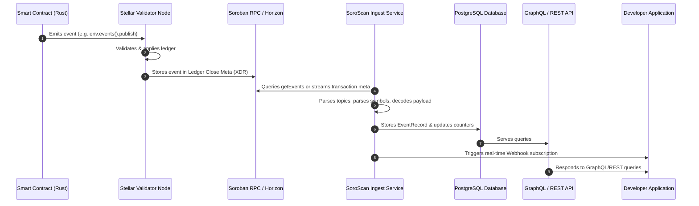

# Getting Started with SoroScan

Welcome to **SoroScan**, the high-performance event indexer and explorer for the Soroban smart contract platform on Stellar.

SoroScan provides developers with a robust set of tools to index, query, and monitor smart contract events in real-time. Whether you are building a DeFi dashboard, a gaming platform, or a supply chain tracker, SoroScan simplifies the process of accessing on-chain data.

---

## 💡 Understanding Soroban Smart Contract Events

In Soroban, smart contracts emit events to broadcast state changes or actions to the outside world. These events are recorded directly in the ledger metadata. However, raw events are stored in a binary format called **XDR (External Data Representation)** and are ephemeral (not indexable directly on-chain).

SoroScan acts as the ingestion and decoding layer that:
1. Listens to ledgers on the Stellar blockchain.
2. Extracts raw events from the transaction metadata.
3. Decodes the binary XDR data into human-readable JSON formats.
4. Stores them in a searchable database.
5. Delivers them via Webhooks, REST, or GraphQL.

---

## 🔄 Event Lifecycle Diagram

Here is a visual map of how a Soroban event travels from a Rust smart contract to your application:



---

## 📦 Raw XDR vs Decoded JSON Payload

Soroban events are emitted as a tuple containing up to four **topics** and a **data payload**. In transaction records, these are serialized as base64-encoded XDR values.

### Raw Event (as returned by raw ledger streams)
```json
{
  "contractId": "CCAAAAAAAAAAAAAAAAAAAAAAAAAAAAAAAAAAAAAAAAAAAAAAAAAAAA",
  "type": "contract",
  "topics": [
    "AAAADwAAAAZ0cmFuc2Zlcg==",
    "AAAADgAAAAC7q4aV1z2p9r48g/H9f/h5k0dM7cT3l06jZ/2/f3eW4w==",
    "AAAADgAAAAC1p3eE9f4n5e66w/h/c/e8q3nL7cT3k02rZ/5/e1a53w=="
  ],
  "value": "AAAADAAAAAEAAAAAbWludGVkX2Ftb3VudAAAAAAAEHQ="
}
```

### Decoded Event (after SoroScan Ingestion and Decoding)
SoroScan reads the contract's ABI (or decodes standard types) and translates the binary payload into a developer-friendly JSON format:

```json
{
  "id": 142589,
  "contract_id": "CCAAAAAAAAAAAAAAAAAAAAAAAAAAAAAAAAAAAAAAAAAAAAAAAAAAAA",
  "event_type": "transfer",
  "ledger": 104820,
  "timestamp": 1785239100,
  "topics": [
    "transfer",
    "GD74A...EX734",
    "GCS3B...TR562"
  ],
  "decoded_payload": {
    "from": "GD74A...EX734",
    "to": "GCS3B...TR562",
    "amount": "1000.00"
  }
}
```

---

## 📖 Glossary of Key Terms

| Term | Definition |
| :--- | :--- |
| **Soroban** | The WebAssembly (Wasm)-based smart contract platform on the Stellar blockchain network. |
| **XDR (External Data Representation)** | A standard data serialization format used across Stellar to represent transactions, ledgers, and contract variables in a compact binary form. |
| **Topics** | A vector of up to 4 values (usually starting with a symbol indicating the event type, followed by identifiers like addresses) used by indexers to filter and route events. |
| **Payload / Data** | The core body of information emitted by the event. It can hold complex data structures (Maps, Vectors, Structs) representing the details of the transition. |
| **Ingestion** | The automated background task of streaming ledgers, extracting emitted event records, and populating SoroScan databases. |
| **Webhook** | A user-configured HTTP callback that enables SoroScan to send real-time POST notifications to an external app whenever a matching event is indexed. |
| **ABI (Application Binary Interface)** | A JSON description of a contract's functions, types, and events, allowing SoroScan to decode raw XDR into named fields. |

---

## 🚀 Quick Setup

### 1. Install an SDK

Choose the SDK that fits your tech stack:

#### Python
```bash
pip install soroscan-sdk

# Optional: query events from the terminal
soroscan events --contract ABC123 --event-type transfer --limit 10
soroscan webhooks list
```

#### TypeScript / JavaScript
```bash
npm install @soroscan/sdk
```

### 2. Basic Usage Example (TypeScript)

```typescript
import { SoroScanClient } from "@soroscan/sdk";

const client = new SoroScanClient({
  baseUrl: "https://api.soroscan.io",
  apiKey: "your-api-key",
});

// Fetch events
const events = await client.getEvents({
  contractId: "CCAAA...",
  first: 10,
});

console.log(events.items);
```

## Next Steps

- Explore the [API Overview](./api-overview.md) to understand the endpoint structure.
- Check out the [Python SDK Guide](./sdk-python.md) or [TypeScript SDK Guide](./sdk-typescript.md) for more details.
- Learn how to set up [Custom Webhooks](./cookbook/webhooks.md) to receive real-time updates.
- Integrate your own contracts with the [Soroban Contract Integration Guide](./cookbook/soroban-contract-integration.md).
- Learn how to [Deploy](./deployment/docker-compose.md) your own SoroScan instance.
