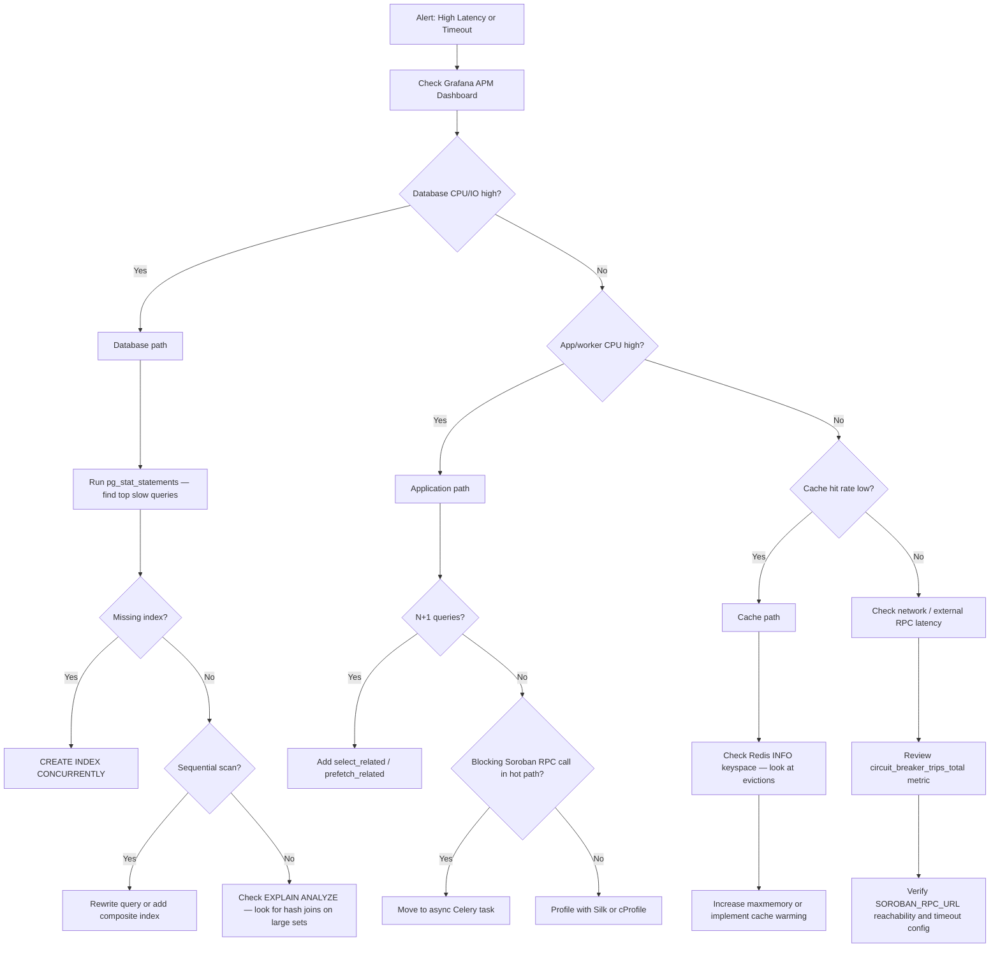
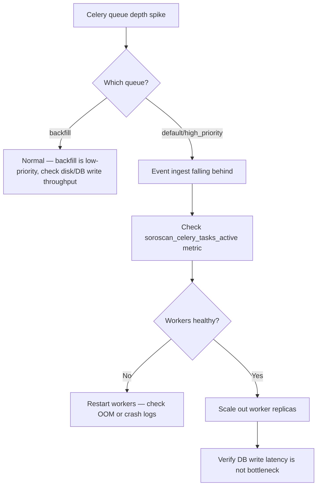

# Performance Tuning Playbook

This playbook gives SoroScan operators a systematic process for diagnosing and resolving performance issues across the full stack — API, database, cache, workers, and blockchain ingestion.

---

## 1. Troubleshooting Flowcharts

### API Latency / Timeout



### Ingestion Backlog



---

## 2. Common Bottlenecks

### Database (PostgreSQL)

| Symptom | Root Cause | Fix |
|---------|-----------|-----|
| Slow `/api/ingest/events/` queries | Missing index on `contract_id` + `ledger_seq` | `CREATE INDEX CONCURRENTLY idx_event_contract_ledger ON ingest_eventrecord(contract_id, ledger_seq DESC)` |
| High I/O on stats queries | Unoptimized `COUNT(*)` without partial index | Add partial indexes for `is_active=True` filters |
| Connection exhaustion | Too many Django / Celery processes opening connections | Configure PgBouncer; tune `DB_POOL_MAX_SIZE` |
| Slow search endpoint | Full table scan on payload JSON | Ensure GIN index on `payload` jsonb column |

### Application (Django / Celery)

| Symptom | Root Cause | Fix |
|---------|-----------|-----|
| Slow contract detail view | N+1 ORM queries | Use `select_related('transaction')` / `prefetch_related('events')` |
| Worker crash / OOM | Unbounded queryset in task | Add `.iterator()` or paginate with `ledger_seq` cursor |
| RPC timeout in request | Blocking `SorobanClient` call | Offload to Celery task; return `202 Accepted` |
| High GC pauses | Large in-memory event list | Stream results with Django's `StreamingHttpResponse` |

### Cache (Redis)

| Symptom | Root Cause | Fix |
|---------|-----------|-----|
| `cache_misses_total` spike after deploy | Cold cache after restart | Run cache warming task before cutover (see §5) |
| Eviction storm | `maxmemory` policy set to `allkeys-lru` with insufficient RAM | Increase Redis memory or reduce `QUERY_CACHE_TTL_SECONDS` |
| Inconsistent reads | Stale cache after contract update | Bust cache key on `TrackedContract.save()` signal |

### Soroban RPC / Ingest

| Symptom | Root Cause | Fix |
|---------|-----------|-----|
| `circuit_breaker_trips_total` rising | RPC provider instability | Review `SOROBAN_RPC_URL`; switch to backup RPC |
| Ledger gaps detected | Polling skipped ledgers under load | Decrease `INGEST_POLL_INTERVAL_SECONDS` or add parallel ingest workers |
| `events_rate_limited_total` rising | Contract `max_events_per_minute` too low | Increase limit via `PUT /api/ingest/contracts/{pk}/` |

---

## 3. Monitoring Dashboards to Check

All metrics are exposed at `GET /metrics` (Prometheus). Import the SoroScan Grafana dashboards from `docs/deployment/monitoring.md`.

### Core API Health

| Prometheus Metric | Warning Threshold | Indicates |
|-------------------|-------------------|-----------|
| `soroscan_http_responses_total{status_class="5xx"}` | > 1% of total | Service errors |
| `django_http_requests_latency_seconds_by_view_method` p95 | > 500 ms | API slowdown |
| `soroscan_db_pool_connections{state="active"}` | > 80% of `DB_POOL_MAX_SIZE` | Connection exhaustion |

### Ingest Pipeline Health

| Prometheus Metric | Warning Threshold | Indicates |
|-------------------|-------------------|-----------|
| `soroscan_celery_queue_depth{queue="default"}` | > 5 000 | Workers lagging |
| `soroscan_ingest_errors_total` rate | > 5/min | Ingest task failures |
| `soroscan_ledger_gaps_total` rate | > 0 | Missed ledgers |
| `soroscan_circuit_breaker_trips_total` | Any increment | RPC instability |

### Cache Performance

| Prometheus Metric | Warning Threshold | Indicates |
|-------------------|-------------------|-----------|
| `soroscan_cache_hits_total` / (`soroscan_cache_hits_total` + `soroscan_cache_misses_total`) | < 80% | Cold or invalidating cache |
| Redis `evicted_keys` (via Redis Exporter) | Any sustained evictions | Memory pressure |

### Webhook Delivery

| Prometheus Metric | Warning Threshold | Indicates |
|-------------------|-------------------|-----------|
| `soroscan_webhook_sla_total{outcome="missed"}` rate | Any | SLA breach |
| `soroscan_webhook_dead_letter_depth` | > 10 | Stalled dead-letter queue |
| `soroscan_webhook_delivery_duration_seconds` p95 | > 30 s | Slow subscriber endpoints |

---

## 4. Database Query Optimization

### Finding Slow Queries

Use `pg_stat_statements` (enabled by default in the SoroScan DB image):

```sql
-- Top 10 slowest queries by average execution time
SELECT
    query,
    calls,
    round((total_exec_time / calls)::numeric, 2) AS avg_ms,
    round(total_exec_time::numeric, 2)            AS total_ms,
    rows / calls                                  AS avg_rows
FROM pg_stat_statements
WHERE calls > 10
ORDER BY avg_ms DESC
LIMIT 10;
```

SoroScan also logs queries exceeding `LOGGING_SLOW_QUERIES_THRESHOLD_MS` (default: 100 ms) via `SlowQueryMiddleware`. Check the `soroscan.slow_queries` logger output:

```bash
docker logs soroscan-backend 2>&1 | grep "Slow query"
```

Or via the admin endpoint (staff only):

```bash
curl -H "Authorization: Bearer <token>" \
  https://api.soroscan.io/api/admin/db/explain/
```

### EXPLAIN ANALYZE a suspect query

```sql
EXPLAIN (ANALYZE, BUFFERS, FORMAT TEXT)
SELECT e.*
FROM ingest_eventrecord e
WHERE e.contract_id = 'CABC123...'
  AND e.ledger_seq BETWEEN 500000 AND 510000
ORDER BY e.ledger_seq DESC
LIMIT 50;
```

Look for:
- `Seq Scan` on large tables → add an index
- `Hash Join` with high rows estimate → check statistics freshness (`ANALYZE`)
- High `Buffers: shared hit=0 read=N` → data not in `shared_buffers`; consider `pg_prewarm`

### Fixing N+1 Queries (Django ORM)

```python
# ❌ Bad — 1 + N queries
events = EventRecord.objects.filter(contract_id="CABC123...")
for event in events:
    print(event.transaction.fee)          # separate query each time

# ✅ Good — single JOIN
events = (
    EventRecord.objects
    .select_related("transaction")
    .filter(contract_id="CABC123...")
)

# ✅ Good — prefetch many-to-many / reverse FK
contracts = (
    TrackedContract.objects
    .prefetch_related("events", "webhooks")
    .filter(is_active=True)
)
```

### Adding Indexes Safely

Always use `CONCURRENTLY` in production to avoid table locks:

```sql
-- Single-column index for contract lookups
CREATE INDEX CONCURRENTLY idx_event_contract
ON ingest_eventrecord(contract_id);

-- Composite index for time-ranged contract queries
CREATE INDEX CONCURRENTLY idx_event_contract_ledger
ON ingest_eventrecord(contract_id, ledger_seq DESC);

-- Partial index for active contracts only
CREATE INDEX CONCURRENTLY idx_contract_active
ON ingest_trackedcontract(id)
WHERE is_active = TRUE;

-- GIN index for JSONB payload search
CREATE INDEX CONCURRENTLY idx_event_payload_gin
ON ingest_eventrecord USING GIN(payload jsonb_path_ops);
```

After adding an index, run `ANALYZE ingest_eventrecord;` so the planner picks it up immediately.

---

## 5. Cache Warming Strategies

### Why Warming Matters

After a Redis restart or first deploy, all cached responses are gone. Incoming requests hit PostgreSQL directly, which can cause a spike in DB load and slow API responses. Pre-warm before traffic arrives.

### Manual Cache Warming Script

```bash
# Warm the N most-queried contracts (adjust limit as needed)
python manage.py shell -c "
from django.core.cache import cache
from soroscan.ingest.models import TrackedContract, EventRecord
from django.db.models import Count

contracts = (
    TrackedContract.objects
    .annotate(event_count=Count('events'))
    .filter(is_active=True)
    .order_by('-event_count')[:20]
)
for contract in contracts:
    key = f'contract_stats:{contract.contract_id}'
    stats = {
        'total_events': contract.events.count(),
        'unique_event_types': (
            EventRecord.objects
            .filter(contract_id=contract.contract_id)
            .values('event_type').distinct().count()
        ),
    }
    cache.set(key, stats, timeout=300)
    print(f'Warmed {contract.contract_id}')
"
```

### Celery Beat Warming Task

Add to `soroscan/ingest/tasks.py` and schedule via `CELERY_BEAT_SCHEDULE`:

```python
@shared_task(name="warm_contract_stats_cache")
def warm_contract_stats_cache():
    """Pre-populate stats cache for the most active contracts."""
    from soroscan.ingest.models import TrackedContract
    from django.db.models import Count

    contracts = (
        TrackedContract.objects
        .annotate(event_count=Count("events"))
        .filter(is_active=True)
        .order_by("-event_count")[:20]
    )
    for contract in contracts:
        # Re-use existing cache-set logic from the stats ViewSet
        contract.refresh_stats_cache()
```

Schedule it to run every 5 minutes during business hours.

### Rolling Deployment Warm-Up

In the deployment Makefile / CI pipeline, before promoting a new pod:

```bash
# 1. Wait for new pod readiness
kubectl rollout status deployment/soroscan-backend

# 2. Run cache warming job
kubectl exec -it deploy/soroscan-backend -- \
  python manage.py shell -c "from soroscan.ingest.tasks import warm_contract_stats_cache; warm_contract_stats_cache()"
```

---

## 6. Load Testing Procedures

Run load tests before any release that touches the ingest pipeline, events query, or search endpoints.

### Prerequisites

```bash
# Install k6 (https://k6.io/docs/getting-started/installation/)
brew install k6        # macOS
choco install k6       # Windows
apt-get install k6     # Debian/Ubuntu
```

### Events Query Load Test

Create `load-tests/events_read.js`:

```javascript
import http from 'k6/http';
import { check, sleep } from 'k6';

const BASE_URL = __ENV.BASE_URL || 'http://localhost:8000';
const API_KEY  = __ENV.API_KEY  || 'test-key';

export const options = {
  stages: [
    { duration: '30s', target: 20  },  // ramp up
    { duration: '2m',  target: 50  },  // sustained load
    { duration: '30s', target: 100 },  // peak spike
    { duration: '30s', target: 0   },  // ramp down
  ],
  thresholds: {
    'http_req_duration{status:200}': ['p(95)<300'],  // 95th percentile < 300 ms
    'http_req_failed':               ['rate<0.01'],  // error rate < 1%
  },
};

export default function () {
  const res = http.get(
    `${BASE_URL}/api/ingest/contracts/CABC123.../events/?page=1&page_size=25`,
    { headers: { Authorization: `Bearer ${API_KEY}` } },
  );
  check(res, {
    'status 200':              r => r.status === 200,
    'has RateLimit-Remaining': r => r.headers['RateLimit-Remaining'] !== undefined,
    'latency < 300ms':         r => r.timings.duration < 300,
  });
  sleep(1);
}
```

Run:

```bash
k6 run \
  -e BASE_URL=https://staging.api.soroscan.io \
  -e API_KEY=your-staging-key \
  load-tests/events_read.js
```

### Ingest Endpoint Load Test

```javascript
import http from 'k6/http';
import { check, sleep } from 'k6';

const BASE_URL = __ENV.BASE_URL || 'http://localhost:8000';
const API_KEY  = __ENV.API_KEY  || 'test-key';

export const options = {
  vus: 10,
  duration: '1m',
  thresholds: {
    'http_req_duration': ['p(95)<500'],
    'http_req_failed':   ['rate<0.05'],
  },
};

export default function () {
  const payload = JSON.stringify({
    contract_id: 'CABC123...',
    event_type:  'transfer',
    payload_hash: 'a'.repeat(64),
  });
  const res = http.post(
    `${BASE_URL}/api/ingest/record/`,
    payload,
    { headers: { 'Content-Type': 'application/json', Authorization: `Bearer ${API_KEY}` } },
  );
  check(res, {
    'accepted': r => r.status === 201 || r.status === 202,
  });
  sleep(0.5);
}
```

### Interpreting Results

| k6 metric | What to look for |
|-----------|-----------------|
| `http_req_duration p(95)` | Should remain below 300 ms for read endpoints |
| `http_req_failed` | Should be < 1%; investigate any `5xx` |
| `iterations` | Throughput — compare against baseline |
| `data_received` | Unusually large → check response payload size / pagination |

After a failed threshold, profile the Django view with Silk (`ENABLE_SILK=true`) or run `EXPLAIN ANALYZE` on the queries emitted during the test.

---

## 7. Metrics Quick-Reference

Full metric catalogue is in `docs/observability/index.md`. Key performance metrics:

| Metric | Labels | Description |
|--------|--------|-------------|
| `soroscan_http_responses_total` | `status_class`, `view` | HTTP response counts by view |
| `soroscan_task_duration_seconds` | `task_name` | Celery task latency histogram |
| `soroscan_celery_queue_depth` | `queue` | Pending tasks per queue |
| `soroscan_db_pool_connections` | `state` | DB pool connection states |
| `soroscan_cache_hits_total` | `cache_type` | Redis cache hits |
| `soroscan_cache_misses_total` | `cache_type` | Redis cache misses |
| `soroscan_events_ingested_total` | `contract_id`, `network` | Ingest throughput |
| `soroscan_ingest_errors_total` | `task_name`, `error_type` | Ingest failure rate |
| `soroscan_circuit_breaker_trips_total` | `name` | RPC circuit breaker opens |
| `soroscan_event_ingestion_rate` | — | Events per second (real-time) |

### Useful PromQL Queries

```promql
# 5-minute p95 API latency per view
histogram_quantile(0.95,
  rate(django_http_requests_latency_seconds_by_view_method_bucket[5m])
)

# Error rate over last 5 minutes
sum(rate(soroscan_http_responses_total{status_class="5xx"}[5m]))
  / sum(rate(soroscan_http_responses_total[5m]))

# Cache hit ratio
rate(soroscan_cache_hits_total[5m])
  / (rate(soroscan_cache_hits_total[5m]) + rate(soroscan_cache_misses_total[5m]))

# Ingest events per second
rate(soroscan_events_ingested_total[1m])
```

---

*See also: `docs/deployment/monitoring.md` · `docs/observability/index.md` · `django-backend/docs/sla.md`*
